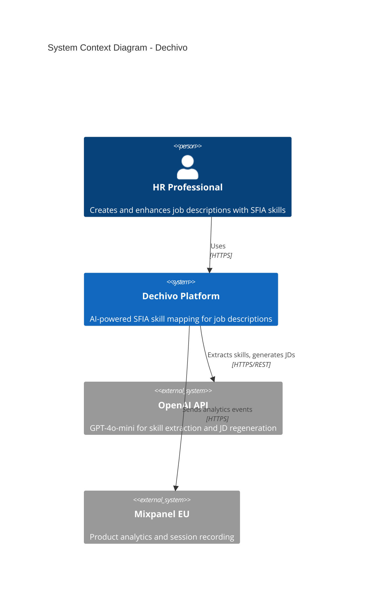
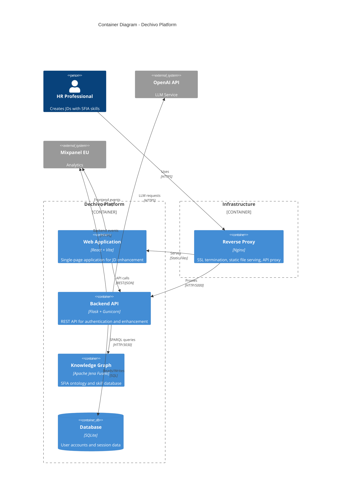
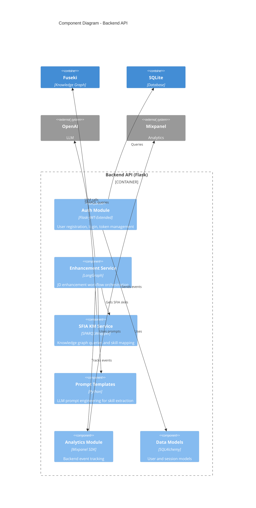
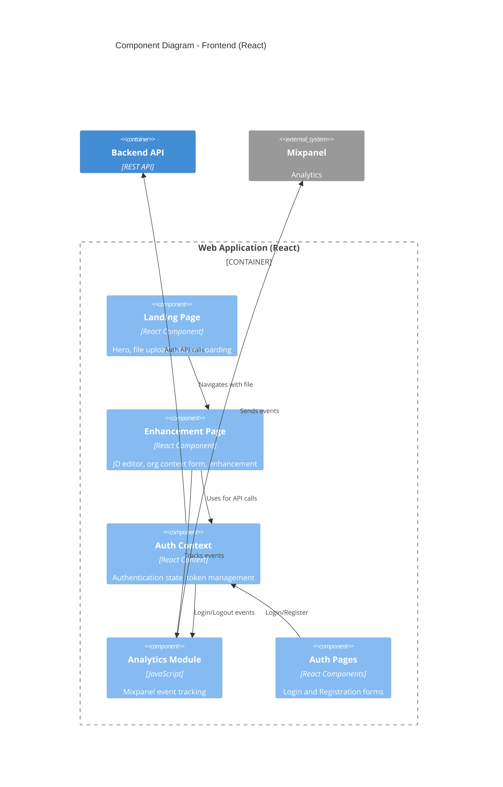
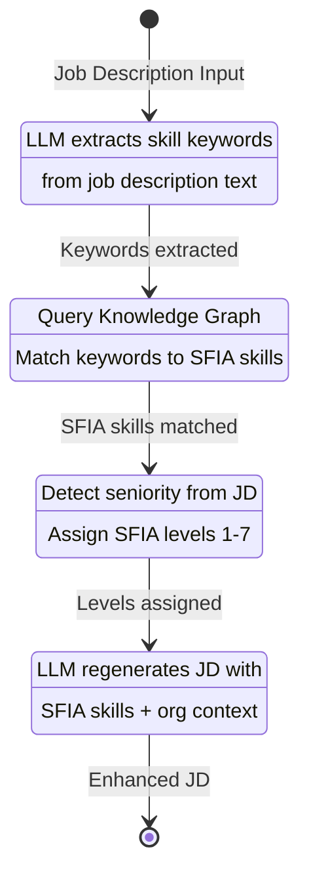
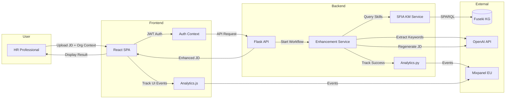

# Dechivo C4 Architecture Document

## Overview

Dechivo is an AI-powered job description enhancement platform that uses the SFIA (Skills Framework for the Information Age) knowledge graph to map skills and competencies. The system leverages LLMs (OpenAI/Ollama) and a SPARQL-based knowledge graph to provide intelligent skill mapping for job descriptions.

---

## Level 1: System Context Diagram



### Context Description

| Element | Type | Description |
|---------|------|-------------|
| HR Professional | User | End users who create and enhance job descriptions |
| Dechivo Platform | System | Main application providing SFIA skill mapping |
| OpenAI API | External System | LLM service for AI-powered text processing |
| Mixpanel EU | External System | Analytics platform for tracking user behavior |

---

## Level 2: Container Diagram



### Container Descriptions

| Container | Technology | Purpose |
|-----------|------------|---------|
| **Web Application** | React 18 + Vite 7 | Interactive SPA for JD creation, org context input, and enhancement |
| **Backend API** | Flask 3.0 + Gunicorn | REST API handling auth, enhancement workflow, and business logic |
| **Knowledge Graph** | Apache Jena Fuseki | SFIA ontology storage and SPARQL query endpoint |
| **Database** | SQLite | User authentication, profiles, and session management |
| **Reverse Proxy** | Nginx | SSL termination, static hosting, API routing |

---

## Level 3: Component Diagram - Backend API



### Component Descriptions

| Component | Responsibility |
|-----------|----------------|
| **Auth Module** | JWT-based authentication, user registration, login/logout, token refresh |
| **Enhancement Service** | LangGraph workflow: Extract Keywords → Map to SFIA → Set Levels → Regenerate JD |
| **SFIA KM Service** | SPARQL queries to Fuseki, skill search by keyword, category, and description |
| **Prompt Templates** | Skill extraction and JD regeneration prompts with org context integration |
| **Analytics Module** | Mixpanel integration for tracking success rates, processing times, errors |
| **Data Models** | SQLAlchemy ORM for User entity with bcrypt password hashing |

---

## Level 3: Component Diagram - Frontend



### Frontend Component Descriptions

| Component | File | Responsibility |
|-----------|------|----------------|
| **Landing Page** | `LandingPage.jsx` | Marketing hero, file upload, CTA |
| **Enhancement Page** | `EnhancementPage.jsx` | JD textarea, org context form, enhance/download actions |
| **Auth Context** | `AuthContext.jsx` | JWT token management, auto-refresh, authenticated fetch |
| **Analytics** | `analytics.js` | Mixpanel tracking utilities |
| **Auth Pages** | `LoginPage.jsx`, `RegisterPage.jsx` | User authentication forms |

---

## Level 4: Code - Enhancement Workflow



### Enhancement Workflow Code Structure

```python
# enhance_jd_service.py - LangGraph Workflow

class EnhancementState(TypedDict):
    job_description: str
    org_context: Dict[str, Any]
    extracted_keywords: List[str]
    sfia_skills: List[Dict]
    enhanced_skills: List[Dict]
    regenerated_jd: str

class JobDescriptionEnhancer:
    def _build_graph(self) -> StateGraph:
        workflow = StateGraph(EnhancementState)
        workflow.add_node("extract_skills", self.extract_skills_node)
        workflow.add_node("map_to_sfia", self.map_to_sfia_node)
        workflow.add_node("set_skill_level", self.set_skill_level_node)
        workflow.add_node("regenerate_jd", self.regenerate_jd_node)
        
        workflow.set_entry_point("extract_skills")
        workflow.add_edge("extract_skills", "map_to_sfia")
        workflow.add_edge("map_to_sfia", "set_skill_level")
        workflow.add_edge("set_skill_level", "regenerate_jd")
        workflow.add_edge("regenerate_jd", END)
        
        return workflow.compile()
```

---

## Data Flow Diagram



---

## Deployment Architecture

```mermaid
flowchart TB
    subgraph Internet
        U[User Browser]
    end
    
    subgraph VPS["VPSDime Server (185.7.81.154)"]
        subgraph Docker["Docker Compose"]
            N[Nginx :443/:80]
            F[Fuseki :3030]
        end
        
        subgraph Systemd["Systemd Services"]
            G[Gunicorn :5000]
        end
        
        subgraph Files["File System"]
            S[/var/www/dechivo]
            D[/opt/dechivo]
            DB[(SQLite DB)]
        end
    end
    
    subgraph External["External Services"]
        O[OpenAI API]
        M[Mixpanel EU]
        GH[GitHub]
    end
    
    U -->|HTTPS| N
    N -->|Static Files| S
    N -->|/api/*| G
    G -->|SPARQL| F
    G -->|LLM| O
    G -->|Analytics| M
    G -->|SQLite| DB
    GH -->|CI/CD Deploy| D
```

---

## Technology Stack Summary

### Frontend
| Technology | Version | Purpose |
|------------|---------|---------|
| React | 18.x | UI Framework |
| Vite | 7.x | Build Tool |
| React Router | 6.x | Client-side Routing |
| Mammoth.js | - | DOCX Parsing |
| PDF.js | - | PDF Parsing |
| Mixpanel Browser | - | Analytics |

### Backend
| Technology | Version | Purpose |
|------------|---------|---------|
| Flask | 3.0.0 | Web Framework |
| Gunicorn | 21.2.0 | WSGI Server |
| LangGraph | 0.2.x | Workflow Orchestration |
| LangChain | 0.3.x | LLM Integration |
| SPARQLWrapper | 2.0.0 | Knowledge Graph Client |
| Flask-JWT-Extended | 4.6.0 | Authentication |
| SQLAlchemy | 3.1.1 | ORM |
| Mixpanel | 4.10.0 | Analytics |

### Infrastructure
| Technology | Purpose |
|------------|---------|
| Nginx | Reverse Proxy, SSL |
| Apache Jena Fuseki | SFIA Knowledge Graph |
| Docker Compose | Container Orchestration |
| Systemd | Service Management |
| Let's Encrypt | SSL Certificates |
| GitHub Actions | CI/CD |

### External Services
| Service | Purpose |
|---------|---------|
| OpenAI API (gpt-4o-mini) | LLM for skill extraction and JD generation |
| Mixpanel EU | Product analytics and session recording |
| GitHub | Source control and CI/CD |

---

## Security Considerations

1. **Authentication**: JWT-based with access/refresh token pattern
2. **Password Storage**: bcrypt hashing
3. **SSL/TLS**: All traffic encrypted via Let's Encrypt certificates
4. **API Security**: Protected endpoints require valid JWT
5. **CORS**: Configured for production domain only
6. **Environment Variables**: Sensitive config stored in `.env` files

---

## Scalability Path

1. **Database**: Migrate SQLite → PostgreSQL for multi-user scaling
2. **Caching**: Add Redis for session and SPARQL query caching
3. **LLM**: Switch to Azure OpenAI for enterprise SLAs
4. **Knowledge Graph**: Cluster Fuseki or migrate to Neptune/Stardog
5. **Deployment**: Kubernetes for horizontal scaling

---

*Document Version: 1.0*
*Last Updated: 2026-01-04*
*Author: Dechivo Team*
